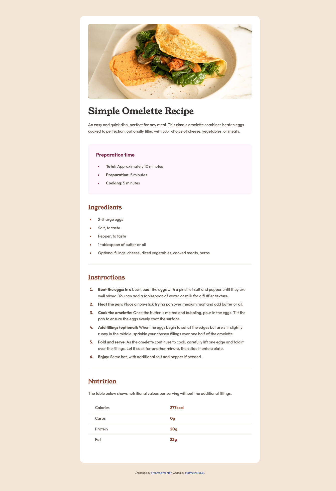

# Frontend Mentor - Recipe page solution

This is a solution to the [Recipe page challenge on Frontend Mentor](https://www.frontendmentor.io/challenges/recipe-page-KiTsR8QQKm). Frontend Mentor challenges help you improve your coding skills by building realistic projects.

## Table of contents

- [Overview](#overview)
  - [The challenge](#the-challenge)
  - [Screenshot](#screenshot)
  - [Links](#links)
- [My process](#my-process)
  - [Built with](#built-with)
  - [What I learned](#what-i-learned)
  - [Continued development](#continued-development)
- [Author](#author)

## Overview

### Screenshot

### Links

- [Solution URL](https://github.com/MattJM1007/Recipe-Page-Challenge)
- [Live Site](https://mattjm1007.github.io/Recipe-Page-Challenge/)

## My process

### Built with

- Semantic HTML5 markup
- CSS

### UPDATE 2025

Refacorted the code one year later after learning much more. Proud of this result

### What I learned

This was definitely a challenge. Formating the lists and tables was difficult and I did not get it quite right. It still looks good I would say but it is not perfect to the design.

### Continued development

I would definitely like to learn the best way to format tables and lists.

## Author

- Frontend Mentor - [@MattJM1007](https://www.frontendmentor.io/profile/MattJM1007)
